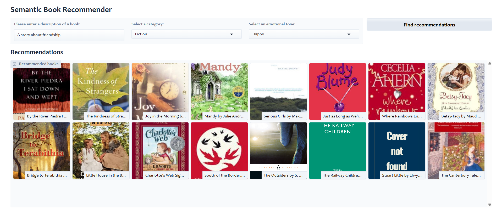

# 📚 Book Recommendation App

This project is a **Book Recommendation System** that suggests books based on user input and emotional preferences. It uses natural language processing, sentiment analysis, and a Gradio-powered dashboard to deliver personalized book recommendations.


---

## 🚀 Features

- Semantic book recommendations based on user-described scenarios
- Emotion-based filtering (Happy, Sad, Surprising, etc.)
- Category-based filtering (e.g., Fiction, Non-fiction, etc.)
- Interactive web interface built with Gradio
- Vector-based similarity search with LangChain and ChromaDB

---

## 🧠 How it works

### 1. Data Exploration
- Raw book data was imported from a Kaggle dataset - https://www.kaggle.com/datasets/dylanjcastillo/7k-books-with-metadata
- Cleaned and filtered to keep relevant records/columns

### 2. Text Classification & Sentiment Analysis (Performed this using GoogleColab for GPU compute)
- Finding categories (Fiction / Non-fiction) for books with missing categories using zero-shot classification
- Book descriptions are tagged with emotional scores (joy, sadness, fear, etc.) using sentiment analysis model
- This enables filtering recommendations based on the user's emotional preference and book categories

### 3. Gradio Dashboard with Vector Store
- A vector store (ChromaDB) is created from book descriptions using LangChain
- Semantic similarity is computed using OpenAI Embeddings
- Gradio interface allows users to search and explore recommendations visually

---

## 🖥 Tech Stack

- **Python**
- **Pandas & NumPy** for data manipulation
- **LangChain & ChromaDB** for semantic search
- **OpenAI Embeddings** for vectorization
- **Gradio** for the web UI
- **dotenv** for environment config

---

## 📦 Setup Instructions

1. **Clone the repo:**

   ```bash
   git clone https://github.com/your-username/Book-Recommendation-App.git
   cd Book-Recommendation-App
   ```

2. **Create a virtual environment and activate it:**

   ```bash
   python -m venv venv
   source venv/bin/activate  # On Windows: venv\Scripts\activate
   ```

3. **Install dependencies:**

   ```bash
   pip install -r requirements.txt
   ```

4. **Set up your `.env` file with OpenAI API key:**

   ```env
   OPENAI_API_KEY=your_openai_key_here
   ```

5. **Run the Gradio app:**

   ```bash
   python gradio_dashboard.py
   ```

---

## 📁 File Structure

```
Book-Recommendation-App/
├── data_exploration.ipynb         # Data cleaning and preprocessing
├── text_classification.ipynb      # Category classification and sentiment tagging
├── gradio_dashboard.py            # Main app interface
├── books_with_emotions.csv        # Cleaned and enriched dataset
├── tagged_description.txt         # Descriptions used for vector DB
└── README.md                      # Project documentation
```

---

## 🙌 Acknowledgements

I followed the **Semantic Book Recommender** tutorial by [freeCodeCamp](https://www.youtube.com/watch?v=Q7mS1VHm3Yw) and JetBrains on YouTube. Big thanks to them for the amazing content!


